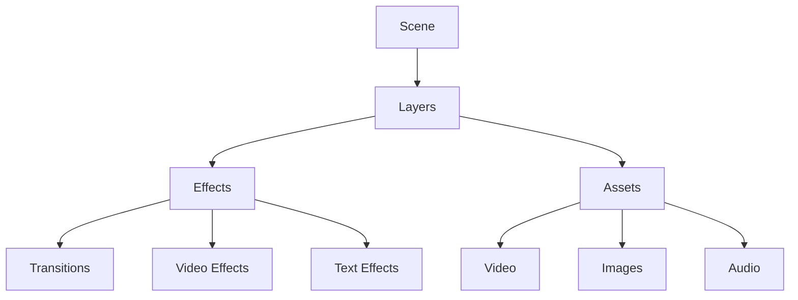

> My AI generated this. I'm building a cinema!

# Cinematic Video Editor Components

## Core Components

### 1. Text Effects
- **Cinematic Title**
  - Fade in/out with scale
  - Customizable font (Montserrat, etc.)
  - Shadow and glow effects
  - Position control (x, y coordinates)
  - Opacity transitions

- **Typing Effect**
  - Character-by-character animation
  - Customizable speed
  - Blinking cursor
  - Font selection
  - Optional sound effects

- **Subtitle System**
  - Multiple styles (centered, bottom-aligned)
  - Fade in/out
  - Support for multiple languages
  - Timing control
  - Background/stroke options

### 2. Transitions

- **Fade Transitions**
  - Fade to/from black
  - Cross-fade between scenes
  - Gradient fade
  - Directional fade (left to right, etc.)

- **Slide Transitions**
  - Slide in/out (all directions)
  - Push transition
  - Reveal transition
  - With/without blur effect

- **Special Transitions**
  - Zoom transition
  - Rotate transition
  - Morph transition
  - Pixel dissolution

### 3. Video Effects

- **Color Grading**
  - Brightness/Contrast
  - Color temperature
  - Saturation
  - Vignette
  - Film grain

- **Motion Effects**
  - Ken Burns effect (pan and zoom)
  - Parallax scrolling
  - Camera shake
  - Slow motion/Speed ramping

- **Overlay Effects**
  - Light leaks
  - Film scratches
  - Dust particles
  - Lens flares
  - Rain/Snow effects

### 4. Audio Components

- **Background Music**
  - Volume fade in/out
  - Loop control
  - Multiple track mixing
  - Audio ducking

- **Sound Effects**
  - Transition sounds
  - Ambient sounds
  - UI feedback sounds
  - Synced with animations

## Component Implementation Structure

### Base Components
```typescript
interface BaseEffect {
  startFrame: number;
  endFrame: number;
  easing?: EasingFunction;
}

interface TextEffect extends BaseEffect {
  text: string;
  font: string;
  size: number;
  color: string;
  position: { x: number; y: number };
}

interface TransitionEffect extends BaseEffect {
  type: TransitionType;
  direction?: Direction;
  duration: number;
}

interface VideoEffect extends BaseEffect {
  type: VideoEffectType;
  intensity: number;
  parameters: Record<string, any>;
}
```

## Scene Management

### Scene Structure
```typescript
interface Scene {
  id: string;
  duration: number;
  layers: Layer[];
  transitions: {
    in?: TransitionEffect;
    out?: TransitionEffect;
  };
}

interface Layer {
  id: string;
  type: LayerType;
  content: VideoClip | ImageAsset | TextEffect;
  effects: VideoEffect[];
  opacity: number;
  zIndex: number;
}
```

## Timeline Integration

- **Timeline Controls**
  - Play/Pause
  - Seek
  - Frame navigation
  - Marker system

- **Layer Management**
  - Add/Remove layers
  - Reorder layers
  - Layer visibility toggle
  - Layer locking

## Effect Parameters

### Common Parameters
```typescript
interface EffectParams {
  // Timing
  duration: number;
  delay: number;
  
  // Animation
  easing: 'linear' | 'easeIn' | 'easeOut' | 'easeInOut';
  
  // Transformation
  scale?: number;
  rotation?: number;
  position?: { x: number; y: number };
  
  // Style
  opacity?: number;
  blur?: number;
  
  // Color
  tint?: string;
  brightness?: number;
  contrast?: number;
}
```

## Future Enhancements

1. **AI Integration**
   - Auto scene detection
   - Smart transitions
   - Content-aware effects
   - Style transfer

2. **Performance Optimization**
   - Frame caching
   - Render queue
   - Preview quality settings

3. **Export Options**
   - Multiple resolutions
   - Format selection
   - Quality presets
   - Platform-specific export (YouTube, Instagram, etc.)

## Component Dependencies



## Usage Examples

### Creating a Cinematic Scene
```typescript
const scene = new Scene({
  duration: 300,
  layers: [
    {
      type: 'video',
      content: videoClip,
      effects: [
        new ColorGrading({ 
          brightness: 1.1,
          contrast: 1.2,
          saturation: 0.9
        }),
        new KenBurnsEffect({
          start: { scale: 1, position: { x: 0, y: 0 } },
          end: { scale: 1.2, position: { x: 100, y: 50 } }
        })
      ]
    },
    {
      type: 'text',
      content: new CinematicTitle({
        text: "Your Story Begins",
        font: "Montserrat",
        animation: "fadeScale"
      })
    }
  ]
});
``` 